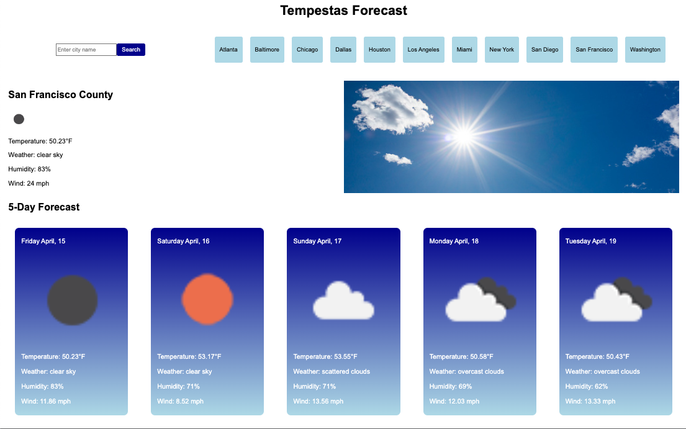

# Tempestas: A Weather dashboard
A dashboard that displays local weather, a 5-day forecast and can search weather in other cities

## Table of Contents

- [Overview](#overview)
- [Preview](#preview)
- [Deployed Link](#deployed-link)

## Overview

As a developer, I want to create a dashboard that shows me the weather in my current location, a 5-day forecast for my location, and allows me to search for weather conditions of other cities.
I want to do this so that I can be prepared for travel conditions.
I want to see visual representations of various weather conditions that are recognizable at a quick glance.
I want quick access to major metropolitan cities in the US without having to use the search bar.
I want to see cities that I have previously searched in the search bar for easy reference.

## Preview

## Deployed Link

[Link to planner](https://winstonheard.github.io/weather-dashboard/) 